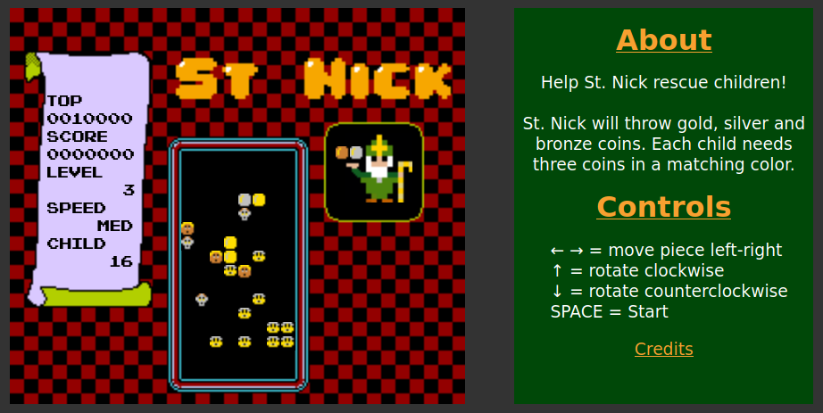

# St. Nick

A Dr. Mario-style game for the holidays. You will need a device with arrow keys to play. Touch interface will be added next.

St. Nicholas of Myra rescued children from slavery by secretly providing the money for their freedom.

Here, St. Nick has gold, silver and bronze coins for the children on the game field. Match three coins on top, below or to the side of a child to free them. A round is won when all children have been freed. The game is lost when the game field fills up and there is no more room for coins.
